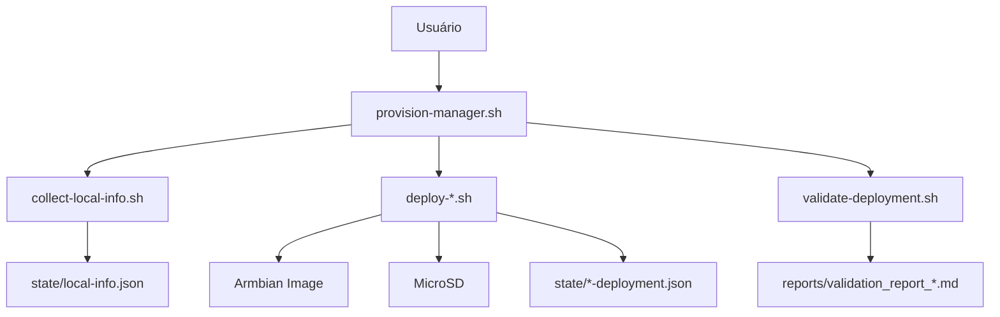

# 🛠️ Guia de Desenvolvimento - Orange Pi Provisioning

Este documento fornece diretrizes completas para desenvolvedores que desejam contribuir ou estender o sistema.

## 📋 Índice

- [Configuração do Ambiente](#configuração-do-ambiente)
- [Arquitetura do Sistema](#arquitetura-do-sistema)
- [Padrões de Código](#padrões-de-código)
- [Fluxo de Desenvolvimento](#fluxo-de-desenvolvimento)
- [Testes e Validação](#testes-e-validação)
- [Documentação](#documentação)
- [Deploy e Release](#deploy-e-release)

## 🚀 Configuração do Ambiente

### Pré-requisitos

```bash
# Ferramentas essenciais
sudo apt-get update
sudo apt-get install -y \
    git \
    docker.io \
    docker-compose \
    shellcheck \
    jq \
    curl \
    wget \
    vim \
    tree

# Configurar Docker para usuário atual
sudo usermod -aG docker $USER
newgrp docker

# Verificar instalação
docker --version
docker compose version
shellcheck --version
jq --version
```

### Configuração do Repositório

```bash
# Clonar repositório
git clone https://github.com/camillanapoles/orange-pi-provisioning.git
cd orange-pi-provisioning

# Configurar Git hooks
cp .githooks/* .git/hooks/
chmod +x .git/hooks/*

# Configurar ambiente de desenvolvimento
cp .env.example .env
```

### Configuração do IDE

#### VS Code (Recomendado)

```json
// .vscode/settings.json
{
    "shellcheck.enable": true,
    "shellcheck.executablePath": "/usr/bin/shellcheck",
    "files.associations": {
        "*.sh": "shellscript"
    },
    "editor.tabSize": 2,
    "editor.insertSpaces": true,
    "files.trimTrailingWhitespace": true,
    "files.insertFinalNewline": true
}
```

#### Extensões Recomendadas

- ShellCheck
- Docker
- JSON Tools
- Markdown All in One
- GitLens

## 🏗️ Arquitetura do Sistema

### Visão Geral

```
orange-pi-provisioning/
├── 🐳 Docker Environment
│   ├── Dockerfile              # Container principal
│   └── docker-compose.yml      # Orquestração
├── 📜 Scripts
│   ├── provision-manager.sh    # Interface principal
│   ├── collect-local-info.sh   # Coleta de dados
│   ├── deploy-*.sh            # Scripts de deploy
│   └── validate-deployment.sh  # Validação
├── ⚙️ Configurações
│   ├── projects-config.json    # Configurações dos projetos
│   └── state-persistence.json  # Estado persistente
├── 📊 Dados Dinâmicos
│   ├── state/                  # Estados dos deployments
│   ├── logs/                   # Logs detalhados
│   ├── images/                 # Imagens Armbian
│   └── reports/                # Relatórios de validação
└── 📚 Documentação
    ├── README.md
    ├── TESTING_GUIDE.md
    ├── USE_CASES.md
    ├── DEVELOPMENT.md
    └── TROUBLESHOOTING.md
```

### Componentes Principais

#### 1. Container Docker

**Dockerfile**:
- Base: Ubuntu 22.04
- Ferramentas: dd, parted, mount, ssh, ping
- Dependências: jq, curl, wget, rsync

#### 2. Scripts Shell

**Padrão de Estrutura**:
```bash
#!/bin/bash
set -euo pipefail

# Configurações globais
SCRIPT_DIR="$(cd "$(dirname "${BASH_SOURCE[0]}")" && pwd)"
PROJECT_ROOT="$(dirname "$SCRIPT_DIR")"

# Funções utilitárias
source "$SCRIPT_DIR/utils.sh"

# Função principal
main() {
    log_info "Iniciando script..."
    # Lógica principal aqui
    log_success "Script concluído com sucesso"
}

# Executar se chamado diretamente
if [[ "${BASH_SOURCE[0]}" == "${0}" ]]; then
    main "$@"
fi
```

#### 3. Configurações JSON

**Estrutura de projects-config.json**:
```json
{
  "projects": {
    "project_name": {
      "description": "Descrição do projeto",
      "hardware": {
        "board": "Orange Pi Zero 3",
        "ram": "2GB",
        "storage": "16GB+"
      },
      "network": {
        "static_ip": "192.168.1.100",
        "hostname": "project-pi",
        "wifi": {
          "ssid": "{{WIFI_SSID}}",
          "password": "{{WIFI_PASSWORD}}"
        }
      },
      "software": {
        "base_image": "Armbian_23.8.1_Orangepizero3_bookworm_current_6.1.47.img.xz",
        "packages": ["package1", "package2"],
        "services": ["service1", "service2"]
      },
      "validation": {
        "ping": true,
        "ssh": true,
        "services": ["service1", "service2"],
        "ports": [22, 80, 443]
      }
    }
  }
}
```

### Fluxo de Dados



## 📝 Padrões de Código

### Shell Script Guidelines

#### 1. Cabeçalho Padrão

```bash
#!/bin/bash
# Nome do Script: script-name.sh
# Descrição: Breve descrição da funcionalidade
# Autor: Nome do Autor
# Data: YYYY-MM-DD
# Versão: 1.0.0

set -euo pipefail  # Fail fast
```

#### 2. Variáveis e Constantes

```bash
# Constantes em MAIÚSCULO
readonly SCRIPT_NAME="$(basename "$0")"
readonly SCRIPT_DIR="$(cd "$(dirname "${BASH_SOURCE[0]}")" && pwd)"
readonly PROJECT_ROOT="$(dirname "$SCRIPT_DIR")"

# Variáveis em minúsculo
local config_file="$PROJECT_ROOT/configs/projects-config.json"
local deployment_state=""
```

#### 3. Funções

```bash
# Documentação da função
# Parâmetros:
#   $1 - Primeiro parâmetro
#   $2 - Segundo parâmetro
# Retorna:
#   0 - Sucesso
#   1 - Erro
function_name() {
    local param1="$1"
    local param2="$2"
    
    # Validação de parâmetros
    if [[ -z "$param1" ]]; then
        log_error "Parâmetro obrigatório não fornecido"
        return 1
    fi
    
    # Lógica da função
    log_info "Executando função..."
    
    return 0
}
```

#### 4. Tratamento de Erros

```bash
# Função de cleanup
cleanup() {
    local exit_code=$?
    log_info "Executando cleanup..."
    
    # Limpar recursos temporários
    [[ -n "${temp_dir:-}" ]] && rm -rf "$temp_dir"
    
    exit $exit_code
}

# Configurar trap
trap cleanup EXIT INT TERM
```

#### 5. Logging

```bash
# Funções de log padronizadas
log_info() {
    echo "[$(date +'%Y-%m-%d %H:%M:%S')] [INFO] $*" >&2
}

log_warn() {
    echo "[$(date +'%Y-%m-%d %H:%M:%S')] [WARN] $*" >&2
}

log_error() {
    echo "[$(date +'%Y-%m-%d %H:%M:%S')] [ERROR] $*" >&2
}

log_success() {
    echo "[$(date +'%Y-%m-%d %H:%M:%S')] [SUCCESS] $*" >&2
}
```

### JSON Configuration Guidelines

#### 1. Estrutura Consistente

```json
{
  "metadata": {
    "version": "1.0.0",
    "created": "2025-01-01T00:00:00Z",
    "updated": "2025-01-01T00:00:00Z"
  },
  "configuration": {
    // Configurações específicas
  }
}
```

#### 2. Validação de Schema

```bash
# Validar JSON antes de usar
validate_json() {
    local json_file="$1"
    
    if ! jq empty "$json_file" 2>/dev/null; then
        log_error "JSON inválido: $json_file"
        return 1
    fi
    
    log_success "JSON válido: $json_file"
    return 0
}
```

## 🔄 Fluxo de Desenvolvimento

### 1. Configuração de Branch

```bash
# Criar branch para nova feature
git checkout -b feature/nova-funcionalidade

# Ou para correção de bug
git checkout -b bugfix/correcao-problema
```

### 2. Desenvolvimento

```bash
# Executar testes durante desenvolvimento
./scripts/run-tests.sh

# Validar código
shellcheck scripts/*.sh
jq empty configs/*.json

# Testar build Docker
docker compose build
```

### 3. Commit Guidelines

```bash
# Formato de commit
git commit -m "tipo(escopo): descrição

Descrição mais detalhada se necessário.

Fixes #123"

# Tipos de commit:
# feat: nova funcionalidade
# fix: correção de bug
# docs: documentação
# style: formatação
# refactor: refatoração
# test: testes
# chore: tarefas de manutenção
```

### 4. Pull Request

```bash
# Push da branch
git push origin feature/nova-funcionalidade

# Criar PR via GitHub CLI (opcional)
gh pr create --title "Nova Funcionalidade" --body "Descrição detalhada"
```

## 🧪 Testes e Validação

### 1. Testes Unitários

```bash
# Criar arquivo de teste
# tests/test-script-name.sh

#!/bin/bash
source "$(dirname "$0")/../scripts/script-name.sh"

test_function_name() {
    # Arrange
    local input="test_input"
    local expected="expected_output"
    
    # Act
    local result
    result=$(function_name "$input")
    
    # Assert
    if [[ "$result" == "$expected" ]]; then
        echo "✅ test_function_name: PASS"
        return 0
    else
        echo "❌ test_function_name: FAIL"
        echo "   Expected: $expected"
        echo "   Got: $result"
        return 1
    fi
}

# Executar teste
test_function_name
```

### 2. Testes de Integração

```bash
# tests/integration-test.sh

#!/bin/bash
set -euo pipefail

test_full_deployment() {
    echo "🧪 Testando deployment completo..."
    
    # Configurar ambiente de teste
    export DRY_RUN=true
    export TEST_MODE=true
    
    # Executar deploy
    if docker compose run --rm provisioner scripts/deploy-ender3.sh; then
        echo "✅ Deployment test: PASS"
        return 0
    else
        echo "❌ Deployment test: FAIL"
        return 1
    fi
}
```

### 3. Testes de Performance

```bash
# tests/performance-test.sh

#!/bin/bash

benchmark_build_time() {
    echo "⏱️ Testando tempo de build..."
    
    local start_time
    local end_time
    local duration
    
    start_time=$(date +%s)
    docker compose build --no-cache
    end_time=$(date +%s)
    
    duration=$((end_time - start_time))
    
    echo "Build time: ${duration}s"
    
    # Verificar se está dentro do limite aceitável (5 minutos)
    if [[ $duration -lt 300 ]]; then
        echo "✅ Build performance: PASS"
        return 0
    else
        echo "❌ Build performance: FAIL (>${duration}s)"
        return 1
    fi
}
```

## 📚 Documentação

### 1. Documentação de Código

```bash
# Documentar funções complexas
# Usar formato JSDoc-like para shell

##
# Executa deploy de projeto específico
# 
# @param {string} project_name - Nome do projeto (ender3|laser)
# @param {string} [device] - Dispositivo de destino (/dev/sdX)
# @return {number} 0 se sucesso, 1 se erro
# @example
#   deploy_project "ender3" "/dev/sdb"
##
deploy_project() {
    local project_name="$1"
    local device="${2:-}"
    
    # Implementação...
}
```

### 2. README Updates

```bash
# Atualizar README.md sempre que:
# - Adicionar nova funcionalidade
# - Modificar comandos existentes
# - Alterar pré-requisitos
# - Adicionar novos casos de uso
```

### 3. Changelog

```markdown
# Changelog

## [1.2.0] - 2025-01-15

### Added
- Nova funcionalidade X
- Suporte para hardware Y

### Changed
- Melhorada performance do deploy
- Atualizada documentação

### Fixed
- Corrigido bug na validação SSH
- Resolvido problema com WiFi

### Removed
- Removida funcionalidade obsoleta Z
```

## 🚀 Deploy e Release

### 1. Preparação de Release

```bash
# Atualizar versão
echo "1.2.0" > VERSION

# Atualizar changelog
vim CHANGELOG.md

# Executar testes completos
./scripts/run-all-tests.sh

# Build final
docker compose build --no-cache
```

### 2. Tagging

```bash
# Criar tag de release
git tag -a v1.2.0 -m "Release version 1.2.0

- Nova funcionalidade X
- Correção de bugs Y e Z
- Melhorias de performance"

# Push da tag
git push origin v1.2.0
```

### 3. GitHub Release

```bash
# Criar release via GitHub CLI
gh release create v1.2.0 \
    --title "Orange Pi Provisioning v1.2.0" \
    --notes-file RELEASE_NOTES.md \
    --draft
```

## 🔧 Ferramentas de Desenvolvimento

### 1. Scripts Utilitários

```bash
# scripts/dev-setup.sh - Configuração inicial
# scripts/run-tests.sh - Executar todos os testes
# scripts/lint.sh - Validação de código
# scripts/build.sh - Build completo
# scripts/clean.sh - Limpeza de ambiente
```

### 2. Makefile

```makefile
# Makefile para automação

.PHONY: help build test lint clean

help:
	@echo "Comandos disponíveis:"
	@echo "  build  - Construir imagem Docker"
	@echo "  test   - Executar testes"
	@echo "  lint   - Validar código"
	@echo "  clean  - Limpar ambiente"

build:
	docker compose build

test:
	./scripts/run-tests.sh

lint:
	shellcheck scripts/*.sh
	jq empty configs/*.json

clean:
	docker compose down
	docker system prune -f
```

### 3. Pre-commit Hooks

```bash
#!/bin/bash
# .git/hooks/pre-commit

echo "🔍 Executando validações pre-commit..."

# Validar shell scripts
if ! shellcheck scripts/*.sh; then
    echo "❌ ShellCheck falhou"
    exit 1
fi

# Validar JSON
if ! find configs/ -name "*.json" -exec jq empty {} \;; then
    echo "❌ Validação JSON falhou"
    exit 1
fi

# Executar testes rápidos
if ! ./scripts/run-quick-tests.sh; then
    echo "❌ Testes rápidos falharam"
    exit 1
fi

echo "✅ Todas as validações passaram"
```

## 📊 Métricas de Desenvolvimento

### Code Quality Metrics

- **Cobertura de Testes**: > 80%
- **Complexidade Ciclomática**: < 10 por função
- **Linhas por Função**: < 50
- **Duplicação de Código**: < 5%

### Performance Metrics

- **Build Time**: < 5 minutos
- **Test Execution Time**: < 2 minutos
- **Deploy Time**: < 15 minutos
- **Memory Usage**: < 512MB durante build

### Quality Gates

- ✅ Todos os testes passam
- ✅ ShellCheck sem warnings
- ✅ JSON válido
- ✅ Documentação atualizada
- ✅ Performance dentro dos limites
- ✅ Segurança validada

---

**Nota**: Este guia é atualizado regularmente conforme o projeto evolui. Contribuições para melhorar o processo de desenvolvimento são sempre bem-vindas.
